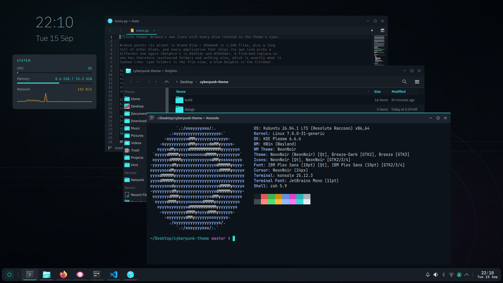
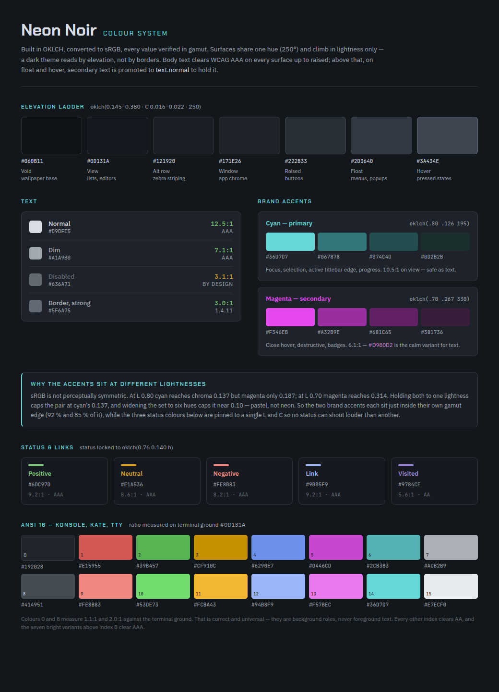
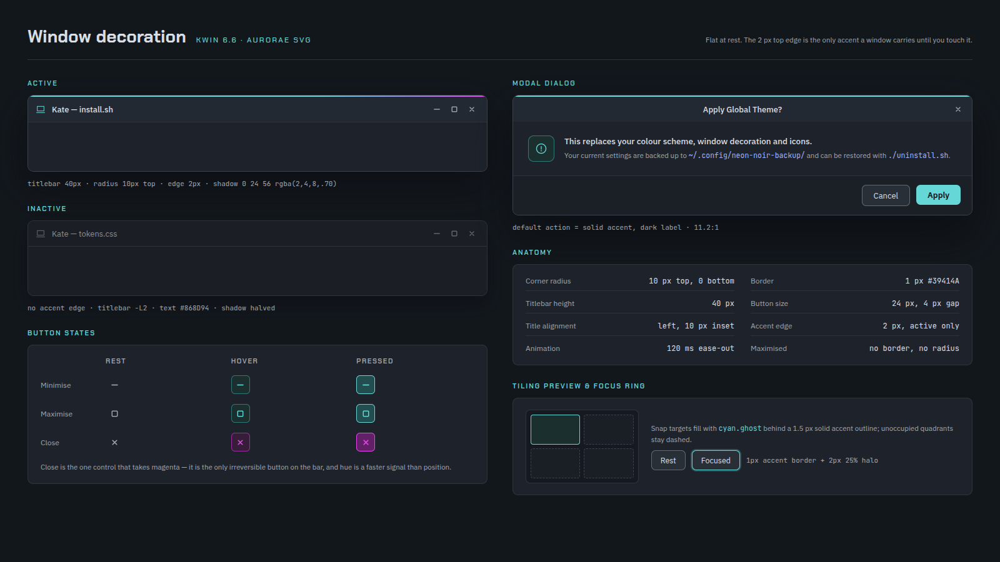
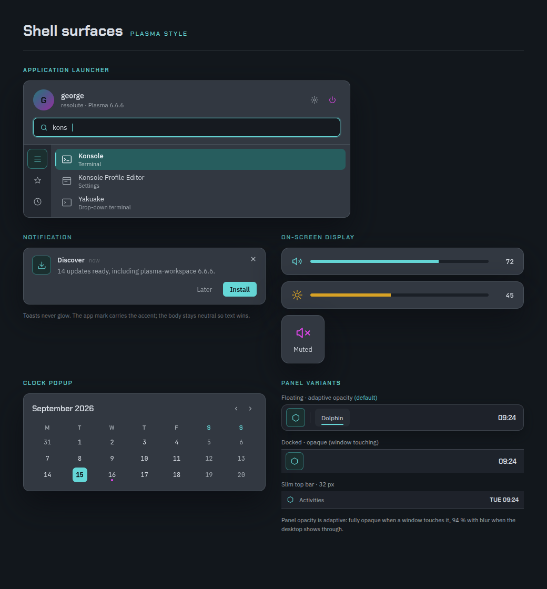
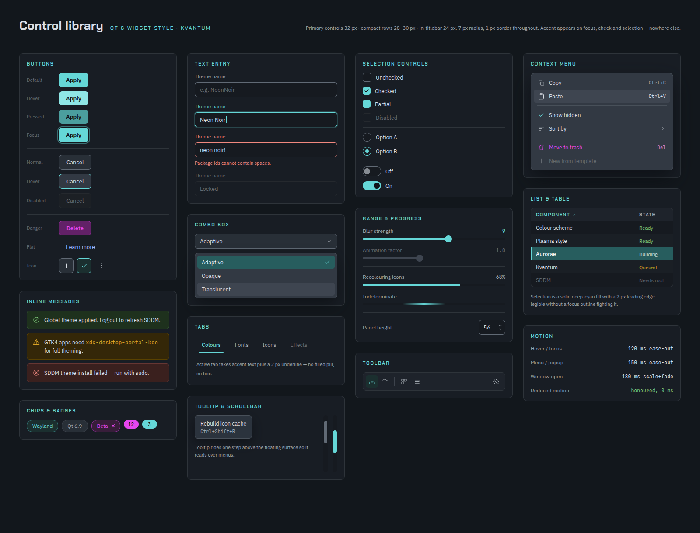
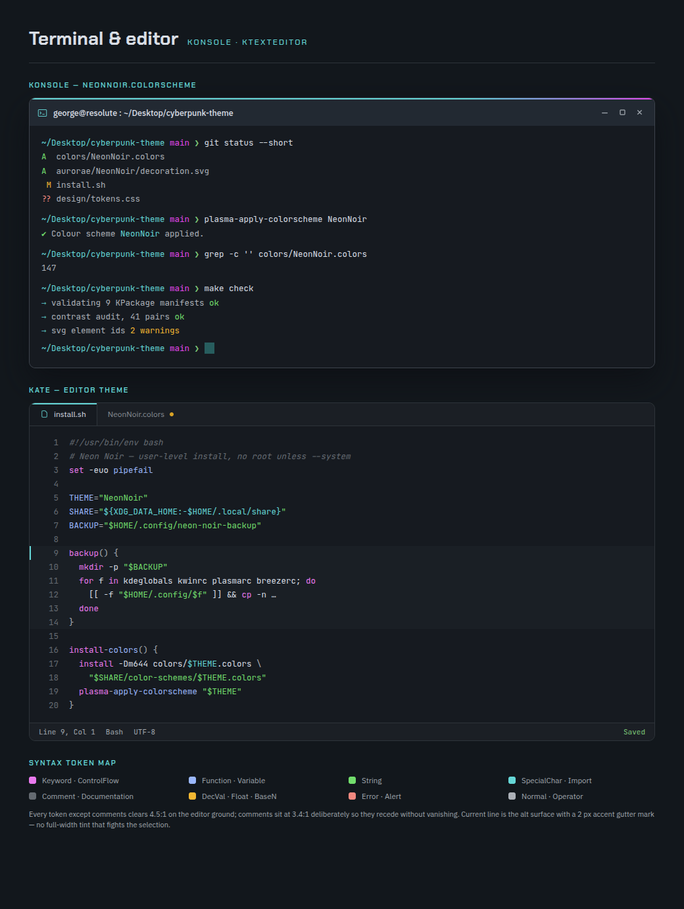
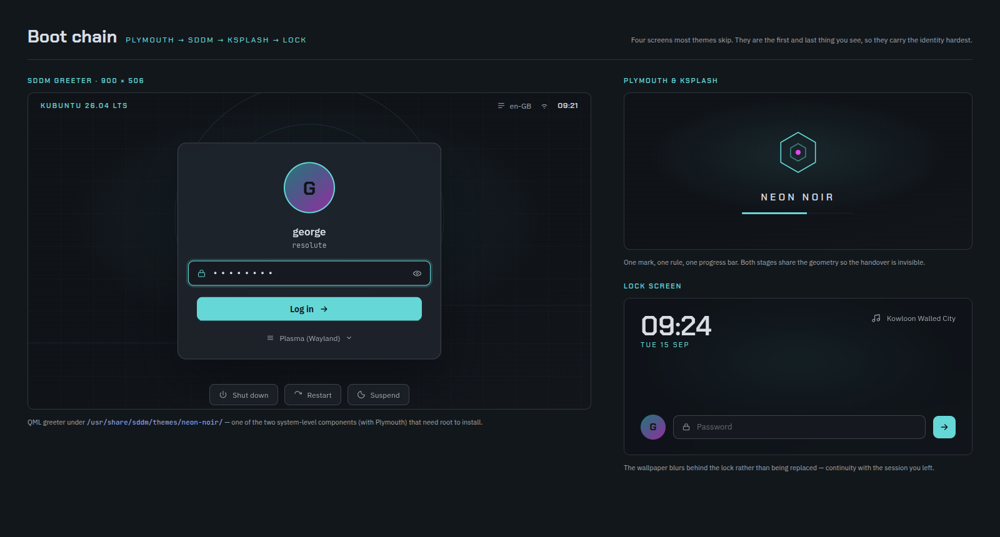
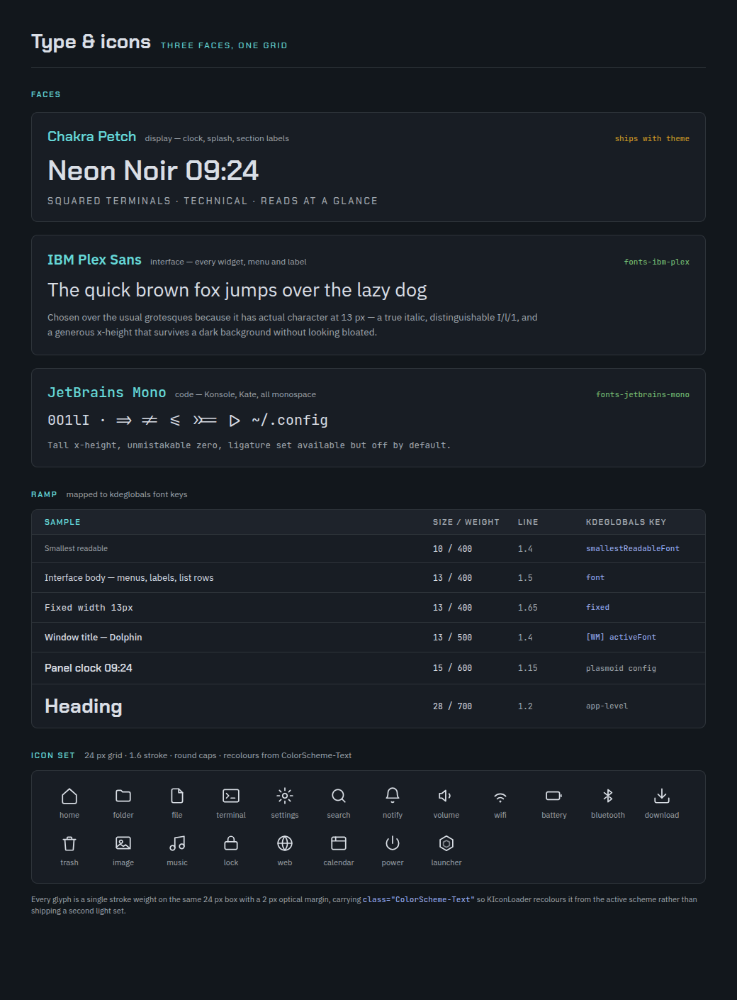
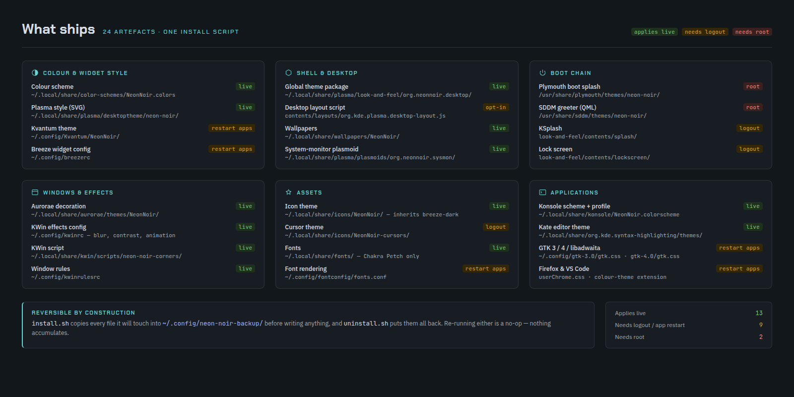

# Neon Noir

> **Work in progress.** Daily-drivable, but see [Limits](#limits).

A dark global theme for **Kubuntu 26.04 / KDE Plasma 6.6** (Wayland, Qt 6).
Cyan and magenta on blue-black. The accent appears on focus, selection, checked
and active states — nowhere else.

Everything is derived from `design/palette.json`. `build/generate.py`
contrast-asserts every foreground/background pair a user actually reads, so an
illegible combination fails the build instead of shipping.

## Screenshot



Live capture. Kate, Dolphin and Konsole on the theme's own source; the clock and
system card are the shipped desktop widgets.

<details>
<summary>Design artboards</summary>

These are the renders the theme is built against, not captures. Where the two
disagree, `TODO.md` records which won and why.

| | |
|---|---|
|  |  |
|  |  |
|  |  |
|  |  |

</details>

## Install

```sh
sudo apt install fonts-ibm-plex fonts-jetbrains-mono qt6-style-kvantum \
                 python3-cairosvg python3-pil python3-numpy

python3 build/generate.py      # palette -> dist/
./install.sh --apply           # install, and switch the live session
./install.sh --system          # SDDM and Plymouth (asks for sudo)
./uninstall.sh [--system]      # put it all back
```

Idempotent. Every file it edits is copied to `~/.config/neon-noir-backup/`
before the first write, along with the colour scheme and cursor theme that were
active beforehand. `--dry-run` shows what it would do and touches nothing.

## What's installed

| Artefact | Destination |
|---|---|
| Colour scheme | `~/.local/share/color-schemes/NeonNoir.colors` |
| Global theme + splash | `~/.local/share/plasma/look-and-feel/org.neonnoir.desktop/` |
| Plasma style | `~/.local/share/plasma/desktoptheme/NeonNoir/` |
| Window decoration (Aurorae) | `~/.local/share/aurorae/themes/NeonNoir/` |
| Widget style (Kvantum) | `~/.config/Kvantum/NeonNoir/` |
| Icon theme | `~/.local/share/icons/NeonNoir/` |
| System widget | `~/.local/share/plasma/plasmoids/org.neonnoir.sysmon/` |
| Options widget | `~/.local/share/plasma/plasmoids/org.neonnoir.control/` |
| Variant scripts and state | `~/.local/share/neon-noir/`, `~/.config/neonnoirrc` |
| Wallpaper | `~/.local/share/wallpapers/NeonNoir/` |
| Konsole scheme + profile | `~/.local/share/konsole/` |
| Kate editor theme | `~/.local/share/org.kde.syntax-highlighting/themes/` |
| GTK 3 / 4 / libadwaita | `~/.config/gtk-{3,4}.0/gtk.css` |
| Font rendering | `~/.config/fontconfig/fonts.conf` |
| VS Code | `~/.vscode/extensions/neon-noir-theme/` |
| Firefox chrome | `<profile>/chrome/userChrome.css` |
| Decoration, effects, fonts | `kwinrc`, `breezerc`, `kdeglobals`, `kcminputrc` |

With `--system`:

| Artefact | Destination |
|---|---|
| SDDM greeter | `/usr/share/sddm/themes/NeonNoir/` |
| Plymouth boot splash | `/usr/share/plymouth/themes/NeonNoir/` |

`dist/icons/` is not committed — 4,598 icons,
~15 MB of generated binaries. `build/generate.py` writes them.

## Limits

- **Lock screen.** Its QML comes from the Plasma *shell* package, not from a
  theme, so only the colours (the scheme's `Complementary` set) and the
  wallpaper are reachable. Layout, clock and controls are fixed.
- **Qt 5 apps** keep Breeze. There is no Qt 5 Kvantum in 26.04.
- **Login and boot** need `--system` and a reboot; `--apply` cannot touch them.
