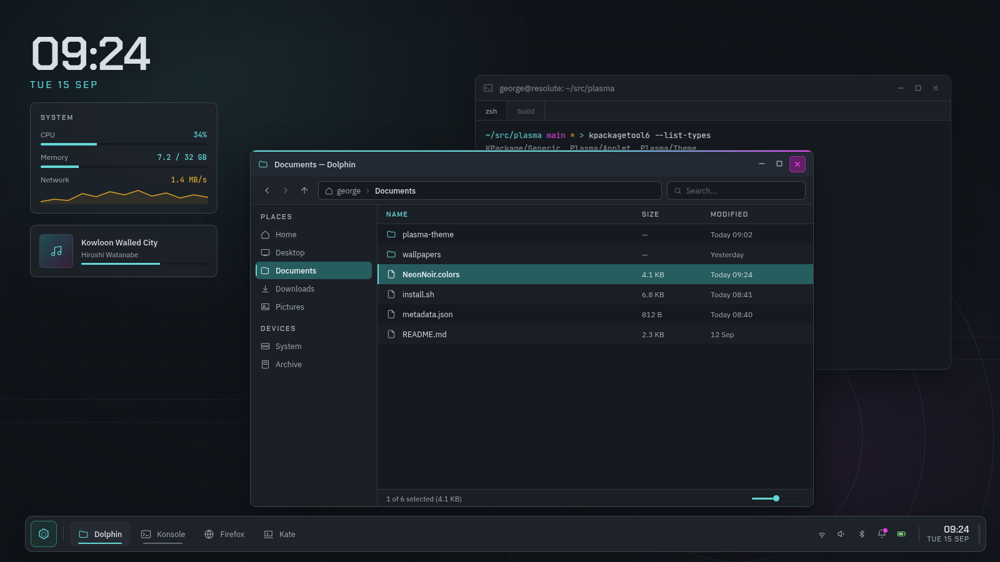

# Neon Noir

> **Work in progress.** Usable day to day, but incomplete — see [Not done yet](#not-done-yet).

A dark global theme for **Kubuntu 26.04 / KDE Plasma 6.6** (Wayland, Qt 6).
Cyan and magenta on blue-black. The accent appears on focus, selection, checked
and active states — nowhere else.

## Screenshots

*Design renders, not live captures.*



| | |
|---|---|
|  |  |
|  |  |
|  |  |
|  |  |

## Install

```sh
python3 build/generate.py     # palette -> artefacts
./install.sh --apply          # install and switch the live session
./uninstall.sh                # put everything back
```

Idempotent. Every config file it edits is copied to `~/.config/neon-noir-backup/`
before the first write, along with the colour scheme that was active beforehand.
`--dry-run` shows what it would do.

## What's installed

| Artefact | Destination |
|---|---|
| Colour scheme | `~/.local/share/color-schemes/NeonNoir.colors` |
| Plasma style | `~/.local/share/plasma/desktoptheme/NeonNoir/` |
| Window decoration (Aurorae) | `~/.local/share/aurorae/themes/NeonNoir/` |
| Icon theme | `~/.local/share/icons/NeonNoir/` |
| Konsole scheme + profile | `~/.local/share/konsole/` |
| Kate editor theme | `~/.local/share/org.kde.syntax-highlighting/themes/` |
| GTK 3 / 4 / libadwaita | `~/.config/gtk-{3,4}.0/gtk.css` |
| Wallpaper | `~/.local/share/wallpapers/NeonNoir/` |
| Decoration, effects, fonts | `kwinrc`, `breezerc`, `kdeglobals` |

## Not done yet

Cursor theme · Kvantum · SDDM · Plymouth · splash · lock screen
